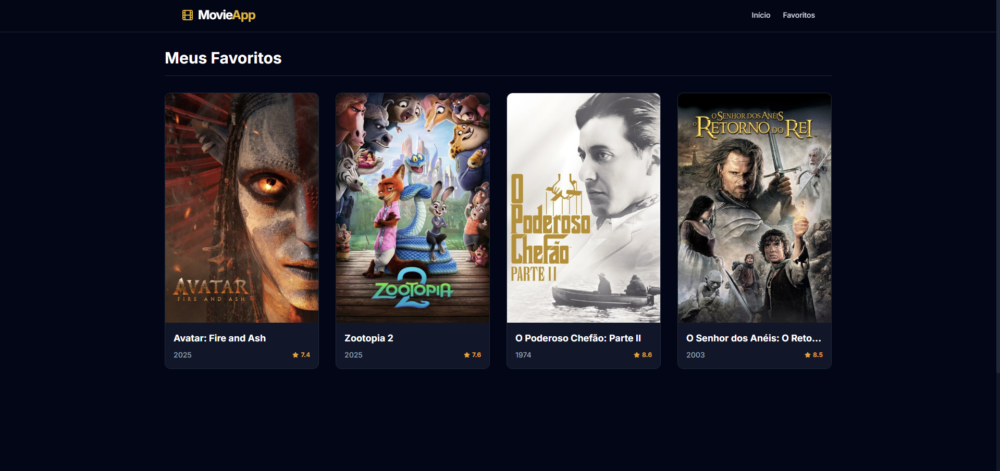

# 🎬 Another Movie App 


Uma aplicação streaming-style para exploração de filmes, trailers e favoritos.

---

## 🔗 Demonstração
👉 **[Acesse o projeto online aqui]()** 

---

<div align="center">
  
</div>

<div align="center">
  
</div>

<div align="center">
  
</div>

## 📱 Sobre o Projeto

O **MovieApp** é uma Single Page Application (SPA) responsiva que consome a API do **TMDB (The Movie Database)**. O objetivo foi praticar React, criando uma interface que simula a navegabilidade de plataformas de streaming.

### ✨ Funcionalidades Principais

* **Exploração Visual:** Layout moderno com grid responsivo e Hero Banners imersivos.
* **Busca & Filtros:** Pesquisa textual e filtragem dinâmica por categorias.
* **Carrossel Interativo:** Lista de "Destaques da Crítica" com scroll horizontal.
* **Página de Detalhes:** Informações mais detalhadas do filme.
* **Sistema de Favoritos:** Gerenciamento de estado global (Context API) para salvar seus filmes preferidos.

---

## 🛠️ Tecnologias Utilizadas

* **Core:** [React](https://reactjs.org/) + [Vite](https://vitejs.dev/)
* **Estilização:** [Tailwind CSS](https://tailwindcss.com/)
* **Roteamento:** [React Router DOM](https://reactrouter.com/)
* **Ícones:** [Lucide React](https://lucide.dev/)
* **Consumo de API:** [Axios](https://axios-http.com/)
* **Fonte:** Inter (Google Fonts)

---

## 🚀 Como Rodar Localmente

Siga os passos abaixo para executar o projeto na sua máquina:

### 1. Clone o repositório
```bash
git clone https://github.com/Tiegow/Another-Movie-App-REACT.git
cd movie-app
```

### 1. Instale as dependências
```bash
npm install
```

### 3. Configure as Variáveis de Ambiente
Crie um arquivo .env na raiz do projeto. Você precisará de uma chave de API do TMDB (é gratuita).
```bash
VITE_API_KEY=sua_chave_da_api_tmdb_aqui
VITE_API_URL=https://api.themoviedb.org/3
```

### Execute o projeto
```bash
npm run dev
```