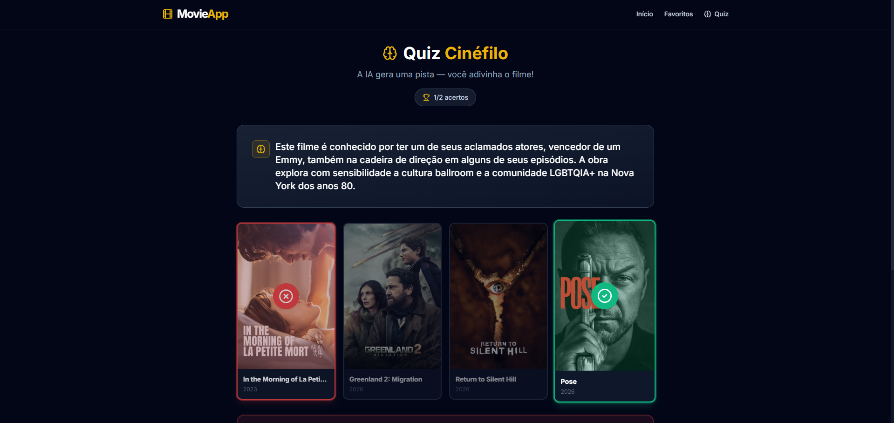
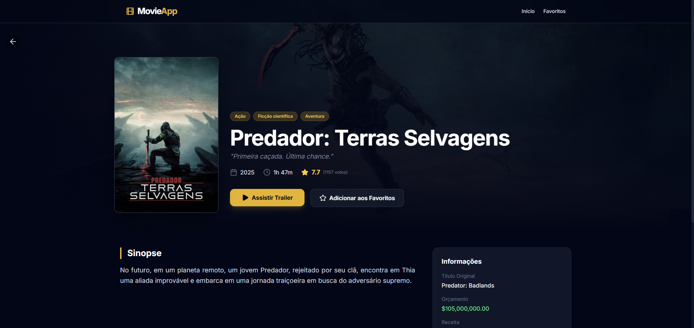
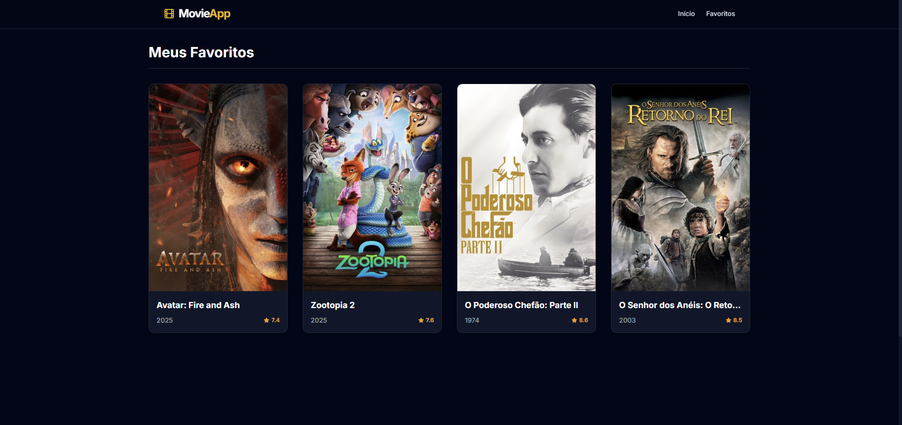

# 🎬 Another Movie App 


Uma aplicação streaming-style com arquitetura Full-Stack para exploração de filmes, trailers, favoritos e interações com Inteligência Artificial.

---

## 🔗 Demonstração
👉 **[Acesse o projeto online aqui](https://another-movie-app-react.vercel.app/)** 

---

### Integração com IA
<div align="center">
  
</div>

### Exploração e Busca
<div align="center">
  
</div>

### Detalhes
<div align="center">
  
</div>

### Favoritos
<div align="center">
  
</div>

## 📱 Sobre o Projeto

O **MovieApp** é uma aplicação Full-Stack composta por um frontend responsivo em React/Vite e uma API no backend desenvolvida com **Java e Spring Boot**. O sistema consome a API do **TMDB (The Movie Database)** para dados cinematográficos e utiliza a **Gemini API** para gerar interações inteligentes. A divisão em backend e frontend garante que as chaves de API permaneçam seguras no servidor.

### ✨ Funcionalidades Principais

* **Exploração Visual:** Layout moderno com grid responsivo e Hero Banners imersivos.
* **Busca & Filtros:** Pesquisa textual e filtragem dinâmica por categorias.
* **Carrossel Interativo:** Lista de "Destaques da Crítica" com scroll horizontal.
* **Página de Detalhes:** Informações detalhadas com trailers e elenco.
* **Sistema de Favoritos:** Gerenciamento de estado global para salvar os filmes que você curte.
* **Integração com IA (Google Gemini):** Utiliza o poder da IA generativa através do backend para interações dinâmicas sobre o contexto do filme.

---

## 🛠️ Tecnologias Utilizadas

### Frontend
* **Core:** [React 19](https://reactjs.org/) + [Vite](https://vitejs.dev/)
* **Estilização:** [Tailwind CSS](https://tailwindcss.com/)
* **Roteamento:** [React Router DOM](https://reactrouter.com/)
* **Ícones:** [Lucide React](https://lucide.dev/)
* **Requisições HTTP:** [Axios](https://axios-http.com/)

### Backend
* **Core:** Java 21 + [Spring Boot 3.x](https://spring.io/projects/spring-boot)
* **Integrações:** TMDB API Centralizada e Google Gemini AI
* **Segurança:** Configurações globais de CORS, isolamento completo de chaves (`.env` via sistema) das requisições originais.

---

## 🚀 Como Rodar Localmente

Siga os passos abaixo para executar os serviços (backend e frontend) na sua máquina:

### 1. Clone o repositório
```bash
git clone https://github.com/Tiegow/Another-Movie-App-REACT.git
cd Another-Movie-App-REACT
```

### 2. Configurando o Backend (Spring Boot)
1. Navegue até o diretório do backend:
   ```bash
   cd backend
   ```
2. Defina as variáveis de ambiente necessárias. Você pode criar um arquivo (ou configurar no seu sistema/IDE):
   `GEMINI_API_KEY`: Sua chave de API do [Google Gemini/AI Studio](https://aistudio.google.com/app/apikey)
   `TMDB_API_KEY`: Sua chave de API do [TMDB](https://developer.themoviedb.org/docs/getting-started)
   `PORT`: Porta do servidor (padrão `8080`)
3. Execute a aplicação (por padrão, iniciará em `http://localhost:8080`):
   ```bash
   ./mvnw spring-boot:run
   ```

### 3. Configurando o Frontend (React / Vite)
1. Volte à raiz do projeto e acesse o diretório do frontend:
   ```bash
   cd ../frontend
   ```
2. Instale todas as dependências do projeto React:
   ```bash
   npm install
   ```
3. Configure a URL da API. Crie um arquivo chamado `.env` nesta pasta com a seguinte variável apontando para o seu backend executando localmente:
   ```bash
   VITE_BACKEND_URL=http://localhost:8080
   ```
4. Execute o frontend localmente:
   ```bash
   npm run dev
   ```
5. Agora é só abrir a URL (geralmente `http://localhost:5173`) indicada no seu terminal para ver a aplicação funcionando!
